# Application Architecture

## High-Level Architecture Diagram

```mermaid
graph TB
    subgraph "User Layer"
        User[👤 User Browser]
    end

    subgraph "AWS Cloud - eu-central-1"
        subgraph "Content Delivery & Static Hosting"
            CF[☁️ CloudFront Distribution<br/>d3qlp39n4pyhxb.cloudfront.net]
            S3[🪣 S3 Bucket<br/>Static Assets<br/>HTML, CSS, JS]
        end

        subgraph "Authentication"
            Cognito[🔐 Cognito User Pool<br/>eu-central-1_B1NKA94F8<br/>Hosted UI]
            CognitoClient[👤 App Client<br/>OAuth 2.0 / OIDC]
        end

        subgraph "API Layer"
            APIGW[🚪 API Gateway HTTP API<br/>mowswsomwf.execute-api<br/>JWT Authorizer]
            
            subgraph "Lambda Functions"
                SubmitLambda[⚡ Submit Handler<br/>POST /submit]
                RecentLambda[⚡ Recent Handler<br/>GET /recent]
                HistoryLambda[⚡ History Handler<br/>GET /history]
            end
        end

        subgraph "Data Layer"
            DDB[(🗄️ DynamoDB Table<br/>data-collection-submissions<br/>PK: user_id<br/>SK: timestamp_utc)]
        end

        subgraph "Monitoring & Logs"
            CW[📊 CloudWatch Logs<br/>/aws/lambda/*]
        end
    end

    %% User Interactions
    User -->|1. HTTPS Request| CF
    CF -->|Serves Static Files| S3
    CF -->|Returns HTML/CSS/JS| User
    
    %% Authentication Flow
    User -->|2. Login Button| Cognito
    Cognito -->|OAuth 2.0 Authorize| CognitoClient
    CognitoClient -->|3. Redirect with code| User
    User -->|4. Exchange code for tokens| Cognito
    Cognito -->|5. JWT Access Token<br/>ID Token| User

    %% API Requests
    User -->|6. API Call + JWT Token<br/>Authorization: Bearer| APIGW
    APIGW -->|Validates JWT| Cognito
    
    %% Submit Flow
    APIGW -->|Authorized Request| SubmitLambda
    SubmitLambda -->|Parse Decimal<br/>Validate Data| SubmitLambda
    SubmitLambda -->|Write Item| DDB
    
    %% Recent Flow
    APIGW -->|Authorized Request| RecentLambda
    RecentLambda -->|Query last 3 days<br/>Limit 3 items| DDB
    DDB -->|Items with Decimal| RecentLambda
    RecentLambda -->|Serialize to JSON| User
    
    %% History Flow
    APIGW -->|Authorized Request| HistoryLambda
    HistoryLambda -->|Query with pagination| DDB
    DDB -->|Items with Decimal| HistoryLambda
    HistoryLambda -->|Serialize to JSON| User

    %% Logging
    SubmitLambda -.->|Logs| CW
    RecentLambda -.->|Logs| CW
    HistoryLambda -.->|Logs| CW

    %% Styling
    classDef userClass fill:#e1f5ff,stroke:#01579b,stroke-width:2px
    classDef awsClass fill:#ff9900,stroke:#232f3e,stroke-width:2px,color:#000
    classDef authClass fill:#4caf50,stroke:#1b5e20,stroke-width:2px
    classDef apiClass fill:#2196f3,stroke:#0d47a1,stroke-width:2px
    classDef dataClass fill:#9c27b0,stroke:#4a148c,stroke-width:2px
    classDef monitorClass fill:#ff5722,stroke:#bf360c,stroke-width:2px

    class User userClass
    class CF,S3 awsClass
    class Cognito,CognitoClient authClass
    class APIGW,SubmitLambda,RecentLambda,HistoryLambda apiClass
    class DDB dataClass
    class CW monitorClass
```

## Detailed Architecture Flow

```mermaid
sequenceDiagram
    autonumber
    participant User as 👤 User Browser
    participant CF as ☁️ CloudFront
    participant S3 as 🪣 S3 Bucket
    participant Cognito as 🔐 Cognito
    participant API as 🚪 API Gateway
    participant Lambda as ⚡ Lambda
    participant DDB as 🗄️ DynamoDB

    %% Initial Load
    rect rgb(240, 248, 255)
        Note over User,S3: Initial Page Load
        User->>CF: GET https://d3qlp39n4pyhxb.cloudfront.net
        CF->>S3: Fetch index.html, app.js, auth.js
        S3-->>CF: Static files
        CF-->>User: HTML + JavaScript
    end

    %% Authentication
    rect rgb(240, 255, 240)
        Note over User,Cognito: OAuth 2.0 Authentication Flow
        User->>Cognito: Click "Login with Cognito"
        Note over Cognito: Hosted UI Login Page
        User->>Cognito: Enter credentials
        Cognito->>User: Redirect with authorization code
        User->>Cognito: POST /oauth2/token<br/>(code, client_id)
        Cognito-->>User: JWT tokens<br/>(access_token, id_token)
        Note over User: Store tokens in localStorage
    end

    %% Form Submission
    rect rgb(255, 248, 240)
        Note over User,DDB: Form Submission Flow
        User->>API: POST /submit<br/>Authorization: Bearer {token}<br/>Body: {datum, uhrzeit, betriebsstunden, starts, verbrauch_qm}
        API->>Cognito: Validate JWT signature
        Cognito-->>API: Valid (claims: sub, email)
        API->>Lambda: Invoke Submit Handler<br/>event.requestContext.authorizer.jwt.claims
        
        Note over Lambda: Extract user_id from JWT claims<br/>Parse JSON with parse_float=Decimal
        Lambda->>Lambda: Validate input data
        Lambda->>DDB: Query latest previous submission<br/>PK=user_id, ScanIndexForward=false, Limit=1
        DDB-->>Lambda: previous_item (or none)
        Lambda->>Lambda: Compute deltas (current - previous)<br/>(first submission => deltas=0)
        Lambda->>Lambda: Create submission object (includes delta_* fields)
        Lambda->>DDB: PutItem<br/>{user_id, timestamp_utc, verbrauch_qm: Decimal("10.5"), delta_betriebsstunden, delta_starts, delta_verbrauch_qm}
        DDB-->>Lambda: Success
        Lambda-->>API: 200 OK<br/>{submission_id, timestamp_utc}
        API-->>User: Success response
        Note over User: Show success message
    end

    %% Recent Submissions
    rect rgb(255, 240, 255)
        Note over User,DDB: Recent Submissions Query
        User->>API: GET /recent<br/>Authorization: Bearer {token}
        API->>Cognito: Validate JWT
        Cognito-->>API: Valid
        API->>Lambda: Invoke Recent Handler
        Lambda->>DDB: Query<br/>user_id = :sub<br/>timestamp_utc > :3_days_ago<br/>Limit: 3, ScanIndexForward: false
        DDB-->>Lambda: Items (with Decimal values)
        Note over Lambda: Serialize Decimals to float<br/>using json.dumps(default=_json_default)
        Lambda-->>API: 200 OK<br/>{submissions: [...]}
        API-->>User: JSON array
        Note over User: Display in Recent tab
    end

    %% History with Pagination
    rect rgb(248, 240, 255)
        Note over User,DDB: Full History with Pagination
        User->>API: GET /history?limit=20<br/>Authorization: Bearer {token}
        API->>Lambda: Invoke History Handler
        Lambda->>DDB: Query<br/>user_id = :sub<br/>Limit: 20<br/>ScanIndexForward: false
        DDB-->>Lambda: Items + LastEvaluatedKey
        Lambda-->>API: 200 OK<br/>{submissions: [...], next_token: "..."}
        API-->>User: JSON with pagination
        
        alt More pages available
            User->>API: GET /history?next_token=xyz
            API->>Lambda: Invoke with token
            Lambda->>DDB: Query with ExclusiveStartKey
            DDB-->>Lambda: Next page items
            Lambda-->>API: Next page data
            API-->>User: More submissions
        end
    end
```

## Component Details

### Frontend (Static Assets)
- **Technology**: Vanilla JavaScript, HTML5, CSS3
- **Location**: S3 bucket, served via CloudFront
- **Key Files**:
  - `index.html` - Main application structure
  - `app.js` - Application logic, form handling
  - `auth.js` - Authentication, token management
  - `config.js` - Environment-specific configuration (generated at build time)

### Authentication (Amazon Cognito)
- **User Pool**: `eu-central-1_B1NKA94F8`
- **App Client**: OAuth 2.0 enabled
- **Flows**: Authorization Code Grant
- **Scopes**: `openid`, `email`, `profile`
- **Token Type**: JWT (JSON Web Token)
- **Hosted UI**: `data-collection-dev.auth.eu-central-1.amazoncognito.com`

### API Gateway (HTTP API)
- **Type**: HTTP API (not REST API)
- **Authorizer**: JWT authorizer (validates Cognito tokens)
- **CORS Configuration**:
  - Allow Origins: `https://d3qlp39n4pyhxb.cloudfront.net`, `http://localhost:8000`
  - Allow Methods: GET, POST, OPTIONS
  - Allow Headers: Content-Type, Authorization
  - Allow Credentials: true
- **Endpoints**:
  - `POST /submit` - Submit new data
  - `GET /recent` - Get last 3 submissions (3 days)
  - `GET /history` - Get all submissions (paginated)

### Lambda Functions
- **Runtime**: Python 3.11
- **IAM Permissions**: DynamoDB read/write
- **Environment Variables**: `SUBMISSIONS_TABLE`
- **Key Libraries**: boto3, decimal

#### Submit Handler
- Validates JWT claims
- Parses JSON with `parse_float=Decimal`
- Validates form data (datum, uhrzeit, betriebsstunden, starts, verbrauch_qm)
- Generates UUID submission_id
- Stores in DynamoDB

#### Recent Handler
- Queries last 3 days of submissions
- Limits to 3 most recent items
- Sorts descending by timestamp
- Serializes Decimal to JSON

#### History Handler
- Queries all user submissions
- Supports pagination via next_token
- Returns 20 items per page
- Serializes Decimal to JSON

### Data Layer (DynamoDB)
- **Table**: `data-collection-submissions-dev`
- **Partition Key**: `user_id` (String) - Cognito sub claim
- **Sort Key**: `timestamp_utc` (String) - ISO-8601 format
- **Attributes**:
  - `submission_id` (String) - UUID v4
  - `datum` (String) - Date in DD.MM.YYYY format
  - `uhrzeit` (String) - Time in HH:MM format
  - `betriebsstunden` (Number) - Operating hours
  - `starts` (Number) - Start count
  - `verbrauch_qm` (Number - Decimal) - Consumption in cubic meters
  - `delta_betriebsstunden` (Number) - Delta to previous submission (can be negative)
  - `delta_starts` (Number) - Delta to previous submission (can be negative)
  - `delta_verbrauch_qm` (Number - Decimal) - Delta to previous submission (can be negative)
- **Billing Mode**: Pay-per-request (on-demand)

## Security Architecture

### Security Features

1. **Transport Layer Security**
   - All traffic over HTTPS/TLS 1.2+
   - CloudFront uses AWS managed certificates
   - API Gateway enforces HTTPS

2. **Authentication & Authorization**
   - OAuth 2.0 / OIDC standard
   - JWT tokens (signed by Cognito)
   - Token validation at API Gateway
   - User isolation via JWT sub claim

3. **API Security**
   - CORS restricted to CloudFront domain
   - JWT authorizer validates every request
   - Lambda receives validated claims
   - No public API endpoints

4. **Data Security**
   - DynamoDB encryption at rest (AWS managed keys)
   - User data isolation via partition key
   - IAM least privilege policies
   - CloudWatch Logs for audit trail

## Deployment Architecture

```mermaid
graph TB
    subgraph "Development"
        Dev[👨‍💻 Developer]
    end

    subgraph "Infrastructure as Code"
        CDK[📦 AWS CDK<br/>Python]
        CFN[☁️ CloudFormation<br/>Stacks]
    end

    subgraph "CI/CD Process"
        Build[🔨 Build Process]
        Deploy[🚀 Deployment]
    end

    subgraph "AWS Environment - dev"
        Infra[🏗️ Infrastructure<br/>CDK Deploy]
        Frontend[🌐 Frontend<br/>S3 + CloudFront]
        Backend[⚙️ Backend<br/>API + Lambda]
    end

    Dev -->|1. Code Changes| CDK
    Dev -->|2. Frontend Build| Build
    
    CDK -->|cdk synth| CFN
    CFN -->|cdk deploy| Infra
    
    Infra -->|Stack: Frontend| Frontend
    Infra -->|Stack: API| Backend
    Infra -->|Stack: Cognito| Frontend
    Infra -->|Stack: DynamoDB| Backend
    
    Build -->|build.sh| Deploy
    Deploy -->|deploy.sh dev| Frontend

    classDef devClass fill:#4caf50,stroke:#1b5e20,stroke-width:2px
    classDef iacClass fill:#2196f3,stroke:#0d47a1,stroke-width:2px
    classDef cicdClass fill:#ff9800,stroke:#e65100,stroke-width:2px
    classDef awsClass fill:#ff9900,stroke:#232f3e,stroke-width:2px

    class Dev devClass
    class CDK,CFN iacClass
    class Build,Deploy cicdClass
    class Infra,Frontend,Backend awsClass
```

## Data Flow Diagrams

### Form Submission Data Flow

### Authentication Flow

## Key Design Decisions

### 1. HTTP API vs REST API
- **Choice**: HTTP API
- **Reason**: Lower latency, lower cost, native JWT authorizer support
- **Trade-off**: Fewer features than REST API (acceptable for this use case)

### 2. CloudFront + S3 vs Amplify Hosting
- **Choice**: CloudFront + S3
- **Reason**: More control, cost-effective, standard CDK patterns
- **Trade-off**: Manual cache invalidation needed

### 3. DynamoDB vs RDS
- **Choice**: DynamoDB
- **Reason**: Serverless, auto-scaling, perfect for key-value access pattern
- **Trade-off**: NoSQL (no complex joins), eventual consistency

### 4. Cognito Hosted UI vs Custom UI
- **Choice**: Cognito Hosted UI
- **Reason**: Fully managed, secure, OAuth 2.0 compliant
- **Trade-off**: Limited UI customization

### 5. Python Decimal for Numeric Values
- **Choice**: Python `decimal.Decimal`
- **Reason**: boto3 DynamoDB requirement, precision for numeric data
- **Trade-off**: Need custom JSON serialization

## Performance Characteristics

| Component | Latency | Throughput | Scaling |
|-----------|---------|------------|---------|
| CloudFront | ~50-100ms | Unlimited | Global edge network |
| API Gateway | ~10-50ms | 10,000 req/s default | Auto-scales |
| Lambda (cold start) | ~500-1000ms | - | Auto-scales |
| Lambda (warm) | ~10-100ms | 1000 concurrent/region | Auto-scales |
| DynamoDB | ~10-20ms | Pay-per-request | Auto-scales |

## Cost Estimation (dev environment)

| Service | Monthly Cost (light usage) |
|---------|----------------------------|
| CloudFront | ~$1-5 (depends on traffic) |
| S3 | <$1 (storage + requests) |
| Cognito | Free (up to 50,000 MAU) |
| API Gateway | $1.00 per million requests |
| Lambda | Free tier covers dev usage |
| DynamoDB | Free tier covers dev usage |
| **Total** | **~$2-10/month** |

## Monitoring & Observability

- **CloudWatch Logs**: All Lambda functions log to `/aws/lambda/{function-name}`
- **CloudWatch Metrics**: API Gateway, Lambda, DynamoDB metrics
- **X-Ray**: Can be enabled for distributed tracing (currently not configured)
- **CloudWatch Alarms**: Can be configured for error rates, latency thresholds

## Disaster Recovery

- **RTO (Recovery Time Objective)**: ~15 minutes (redeploy via CDK)
- **RPO (Recovery Point Objective)**: Zero (DynamoDB continuous backups available)
- **Backup Strategy**: DynamoDB Point-in-Time Recovery (can be enabled)
- **Multi-Region**: Currently single region (eu-central-1)

---

**Document Version**: 1.0  
**Last Updated**: December 2024  
**Architecture Owner**: Development Team

