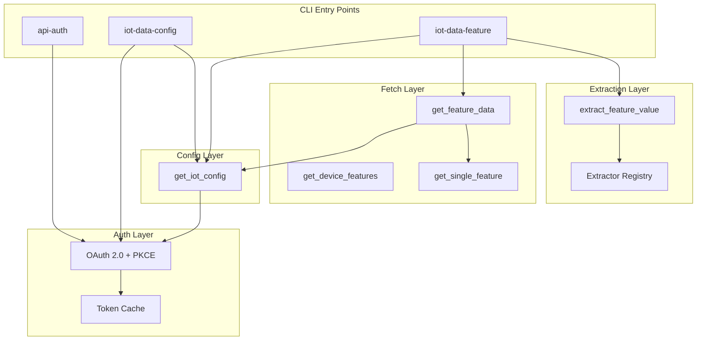
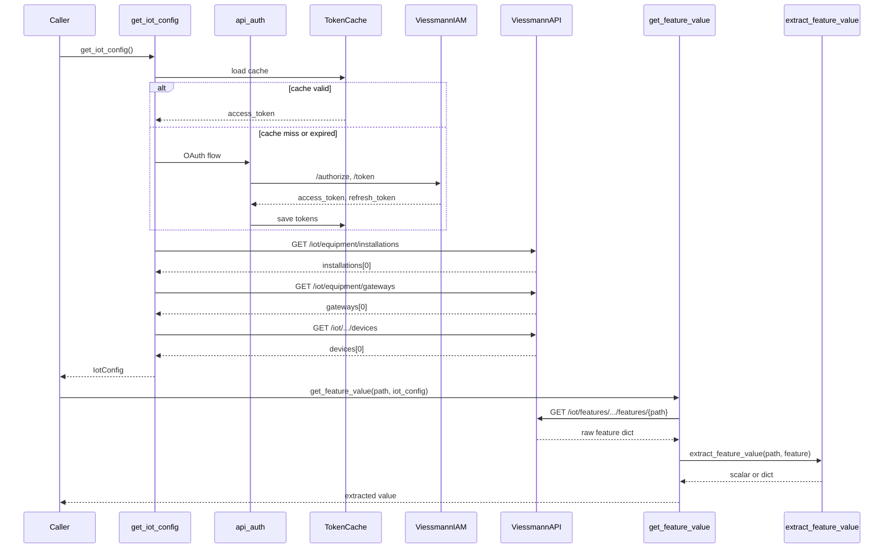
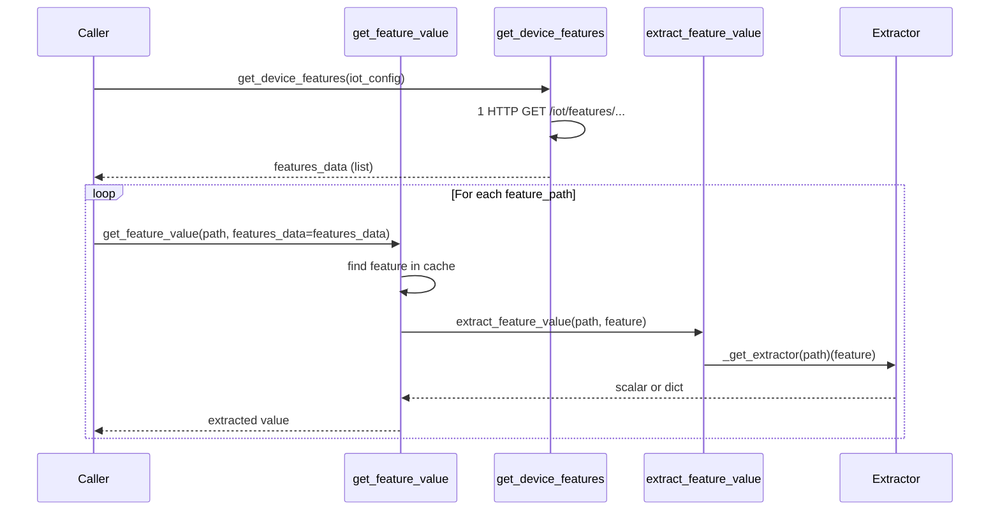
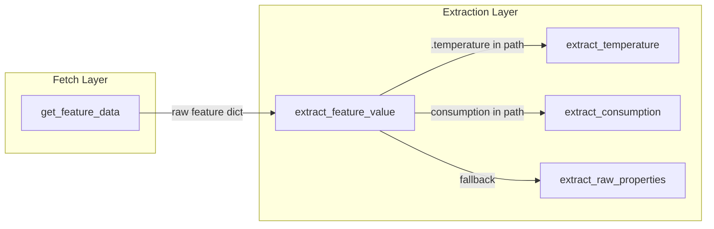

# Viessmann Vis-Connect backend

The `backend/` folder contains a Python package for authenticating with and querying the **Viessmann IoT API** (Vis-Connect). It provides OAuth-based auth, token caching, IoT config resolution, and feature value extraction. It is **not** part of the main web form Lambda/API stack — it runs locally or in scripts.

## architecture

The backend is organized in four layers: **Auth** → **Config** → **Fetch** → **Extract**. Each layer has a single responsibility; higher layers depend on lower ones.



| Layer | Module | Responsibility | Returns |
|-------|--------|----------------|---------|
| **Auth** | `api_auth.auth` | OAuth 2.0 + PKCE; exchange credentials for access token; token refresh | Access token, user info |
| **Config** | `iot_data.get_iot_config` | Resolve installation id, gateway serial, device id from IoT equipment endpoints | `IotConfig` |
| **Fetch** | `iot_data.feature_data_fetcher` | HTTP GET to Viessmann API; parse `data` array | Raw feature dict `{feature, isEnabled, properties, commands}` |
| **Extract** | `iot_data.feature_extractors` | Map feature path to extractor; apply it | Typed value (float, dict, etc.) or raw `properties` |

## data flow

### End-to-end: credentials → extracted value



### Multiple features: one HTTP call, multiple extractions

When querying several features, fetch all features once with `get_device_features`, then pass `features_data` into `get_feature_value` to avoid repeated HTTP calls.



**One HTTP call, multiple extractions.**

### Extraction layer: feature path → typed value

Different features return different shapes. The extraction layer maps feature paths to extractors:

| Feature path pattern | Extractor | Returns |
|----------------------|-----------|---------|
| `*.temperature` | `extract_temperature` | `float` or `None` |
| `*consumption*`, `*heat.production*` | `extract_consumption` | `dict` (full properties) |
| (fallback) | `extract_raw_properties` | `dict` (raw properties) |



## overview

| Component | Purpose |
|-----------|---------|
| `api_auth.auth` | OAuth 2.0 + PKCE flow; exchanges credentials for access token; calls `/users/me` |
| `iot_data.get_iot_config` | Resolves installation id, gateway serial, device id from IoT equipment endpoints |
| `iot_data.feature_data_fetcher` | Fetches device features from the Viessmann API |
| `iot_data.feature_extractors` | Maps feature paths to typed values (temperature, consumption, etc.) |
| `iot_data.feature_value_cli` | CLI to fetch a single feature value and print as JSON |

## setup

From `web-form-verbrauch/backend/`:

```bash
# Install dependencies (uv or pip)
uv sync
# or: pip install -e .
```

Copy `.env.example` to `.env` and fill in credentials:

```bash
cp .env.example .env
# Edit .env: VIESSMANN_CLIENT_ID, VIESSMANN_EMAIL, VIESSMANN_PASSWORD
```

**Important:** Do not commit `.env`. It intentionally contains no secrets in the example; real credentials must be added locally.

## environment variables

| Variable | Required | Default | Description |
|----------|----------|---------|-------------|
| `VIESSMANN_CLIENT_ID` | Yes | — | OAuth client ID from Viessmann Developer Portal |
| `VIESSMANN_EMAIL` | Yes | — | Viessmann account email |
| `VIESSMANN_PASSWORD` | Yes | — | Viessmann account password |
| `VIESSMANN_CALLBACK_URI` | No | `http://localhost:4200/` | OAuth redirect URI |
| `VIESSMANN_SCOPE` | No | `IoT User` | OAuth scope |
| `VIESSMANN_IAM_BASE_URL` | No | `https://iam.viessmann-climatesolutions.com/idp/v3` | IAM base URL (staging/prod) |
| `VIESSMANN_API_BASE_URL` | No | `https://api.viessmann-climatesolutions.com` | API base URL |
| `VIESSMANN_TOKEN_CACHE_PATH` | No | `~/.viessmann/tokens.json` | Token cache file; set empty to disable |
| `VIESSMANN_CODE_VERIFIER` | No | — | Override PKCE code verifier |
| `VIESSMANN_PKCE_METHOD` | No | `S256` | `S256` or `plain` |
| `VIESSMANN_LOG_LEVEL` | No | — | Logging level (e.g. `DEBUG`, `INFO`) |

## CLI entry points

After installing the package (`pip install -e .` or `uv sync`), these commands are available:

### api-auth

Performs OAuth flow and prints the resulting JSON (user info) to stdout.

```bash
api-auth
# Optional: --insecure-skip-ssl-verify, --pkce-method, --code-verifier, --no-token-cache, --log-level
```

### iot-data-config

Fetches IoT identifiers (installation id, gateway serial, device id) and prints as JSON.

```bash
iot-data-config
# Optional: --timeout-seconds, --insecure-skip-ssl-verify, --log-level, --pkce-method, --code-verifier, --no-token-cache
```

### iot-data-feature

Fetches a single feature value and prints as JSON.

```bash
iot-data-feature heating.circuits.0.temperature
# Optional: --timeout-seconds, --insecure-skip-ssl-verify, --log-level, --pkce-method, --code-verifier, --no-token-cache
```

**Exit codes:** 0 = success, 1 = feature not found, 2 = auth/config error.

## feature paths

Feature paths follow the Viessmann IoT API naming (e.g. `heating.circuits.0.temperature`). A reference list of heating-related features is in `backend/data/vis-heating-feature-list.txt`.

Examples:

- `heating.circuits.0.temperature` — supply temperature (extracted as float)
- `heating.circuits.0.sensors.temperature.room` — room temperature
- `heating.boiler.temperature` — boiler temperature
- `heating.consumption.gas` — gas consumption (extracted as properties dict)

## Python API

For use in scripts or other Python code:

```python
from backend.iot_data.get_iot_config import get_iot_config
from backend.iot_data.feature_extractors import get_feature_value

cfg = get_iot_config(timeout_seconds=30.0, ssl_verify=True)
value = get_feature_value("heating.circuits.0.temperature", cfg)
# value: float or None
```

To avoid duplicate HTTP calls when querying multiple features:

```python
from backend.iot_data.get_iot_config import get_iot_config
from backend.iot_data.feature_data_fetcher import get_device_features
from backend.iot_data.feature_extractors import get_feature_value

cfg = get_iot_config()
features = get_device_features(cfg)
temp = get_feature_value("heating.circuits.0.temperature", cfg, features_data=features)
gas = get_feature_value("heating.consumption.gas", cfg, features_data=features)
```

## token cache

By default, tokens are cached at `~/.viessmann/tokens.json` (or `VIESSMANN_TOKEN_CACHE_PATH`). The cache stores `access_token`, `refresh_token`, and `expires_at`. Tokens are refreshed automatically when expired (with a 5‑minute buffer). Use `--no-token-cache` to force a full OAuth flow every run.

## security notes

- Credentials are read from environment variables or `.env`; never hardcoded.
- SSL verification is enabled by default. Use `--insecure-skip-ssl-verify` only when necessary and understand the risk.
- Token cache files are written with restrictive permissions (0o600).
- Error messages are sanitized to avoid leaking tokens or passwords.

## tests

Backend tests live in `web-form-verbrauch/tests/` alongside the main app tests:

- `test_vis_connect_*.py` — OAuth, PKCE, code extraction
- `test_get_iot_config.py` — IoT config resolution
- `test_get_feature_data.py` — Feature fetcher
- `test_feature_extractors.py` — Value extraction
- `test_token_refresh.py` — Token refresh logic

Run from repo root: `task test-backend` or `python3 -m pytest`.
